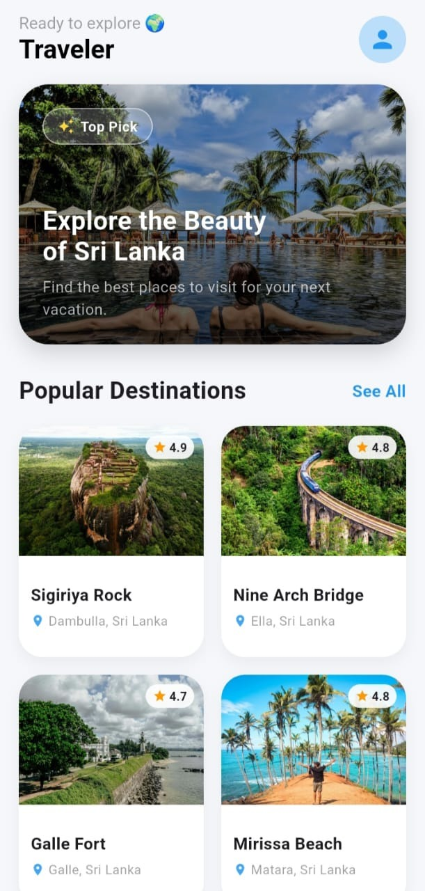
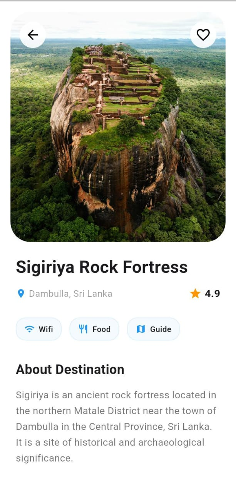
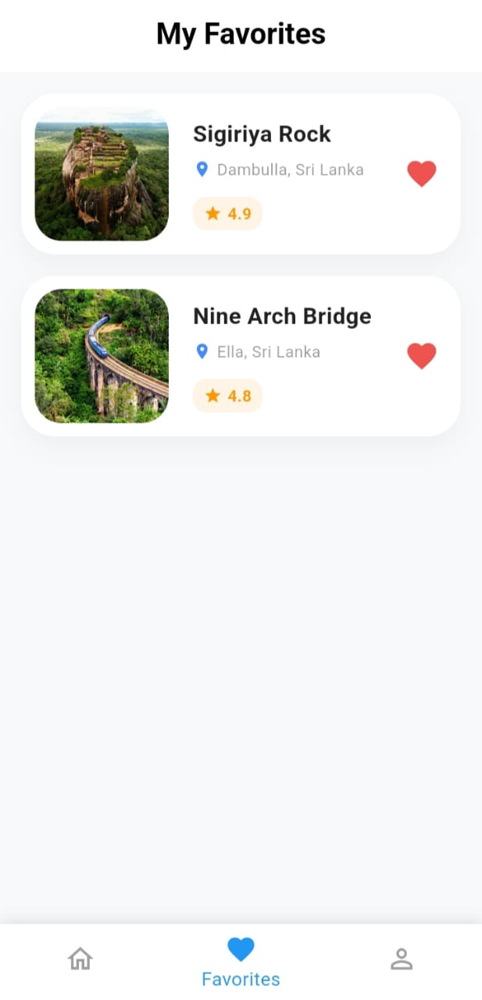
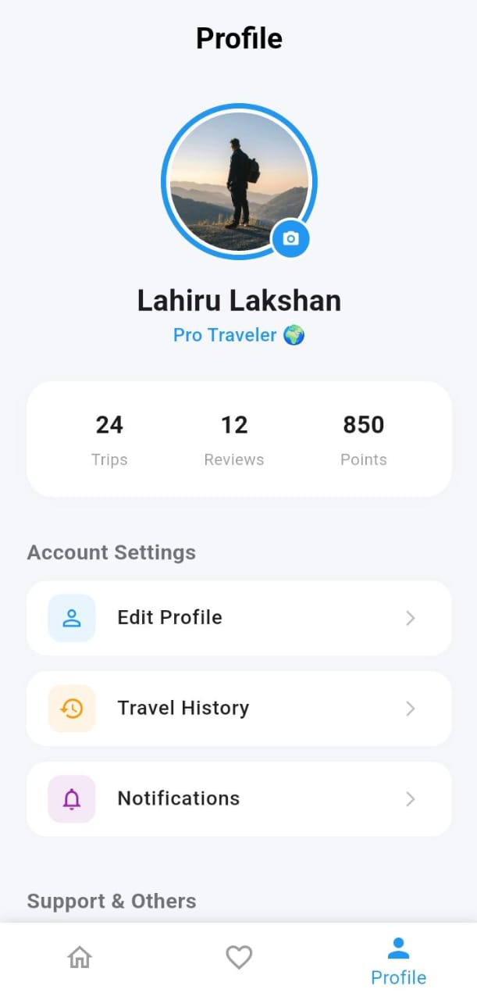

# 🌍 Travel Explore App

A professional, aesthetically pleasing Travel Application developed as part of a Flutter Internship Assessment. This app allows users to explore beautiful travel destinations, view detailed information about each place, and maintain a personal wishlist of favorite locations.

## 🚀 Project Overview
The **Travel Explore App** is designed to provide a seamless user experience for discovering travel spots. It focuses on a clean, modern UI/UX using Material Design principles, emphasizing responsiveness and efficient data handling.

---

## 📱 Key Features
- **Dynamic Home Screen**: A visually appealing landing page featuring a hero banner and a grid-based layout of popular destinations.
- **Detailed Place Information**: Comprehensive details for each destination, including high-quality images, ratings, and descriptions.
- **Wishlist (Favorites) System**: Users can "favorite" destinations from the details page and view them in a dedicated Favorites screen.
- **Profile Management**: A dedicated profile section for user information and account settings.
- **Intuitive Navigation**: A smooth bottom navigation bar for effortless switching between the Home, Favorites, and Profile screens.

---

## 🛠 Technical Implementation

### 1. Architecture & Folder Structure
To ensure maintainability and scalability, the project follows a clean folder structure:
- `lib/models/`: Contains the `Place` model to ensure type-safe data handling.
- `lib/screens/`: Contains all the main page layouts (`HomeScreen`, `DetailsScreen`, `ProfileScreen`, `FavoritesScreen`, and `MainScreen`).
- `lib/widgets/`: Contains reusable UI components (e.g., `PlaceCard`, `CustomBottomNav`, `FacilityChip`) to reduce code duplication.

### 2. Key Flutter Concepts Used
- **State Management**: Used `StatefulWidget` and `setState` to handle dynamic UI updates, such as toggling the favorite status of a destination.
- **Navigation & Routing**: Implemented `Navigator.push` and `Navigator.pop` for seamless page transitions.
- **Data Passing**: Used constructor-based data passing to send `Place` objects from the Home/Favorites screens to the Details screen.
- **Layout Widgets**:
  - `GridView.builder` for efficient, lazy-loaded destination lists.
  - `ListView.builder` for the favorites list.
  - `Stack` & `Positioned` for overlaying elements (like rating badges and back buttons) on images.
  - `SingleChildScrollView` to ensure accessibility across different screen sizes.

### 3. Performance Optimization
- **Lazy Loading**: Utilized `.builder` constructors for lists to optimize memory usage.
- **Refactoring**: Moved repetitive UI elements into separate widget files to improve code readability and performance.

---

## 📦 Installation & Setup
1. Clone this repository:
   ```bash
   git clone https://github.com/Lahiru075/travel_app_task.git
   ```
   
2. Navigate to the project folder:
   ```bash
   cd travel_app_task
   ```

3. Install dependencies:
   ```bash
   flutter pub get
   ```

4. Run the application:
   ```bash
   flutter run
   ```

---

## 📸 Screenshots

| Home Screen | Details Screen | Favorites Screen | Profile Screen |
| :---: | :---: | :---: | :---: |
|  |  |  |  |

---

Developed with ❤️ as part of the Flutter Internship Assessment.
